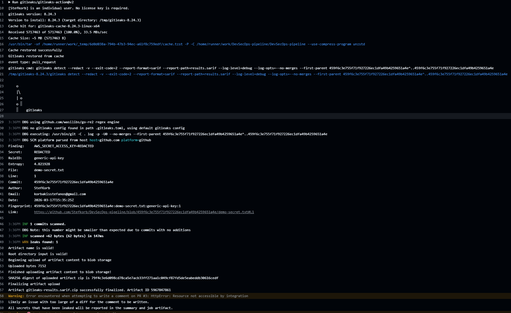
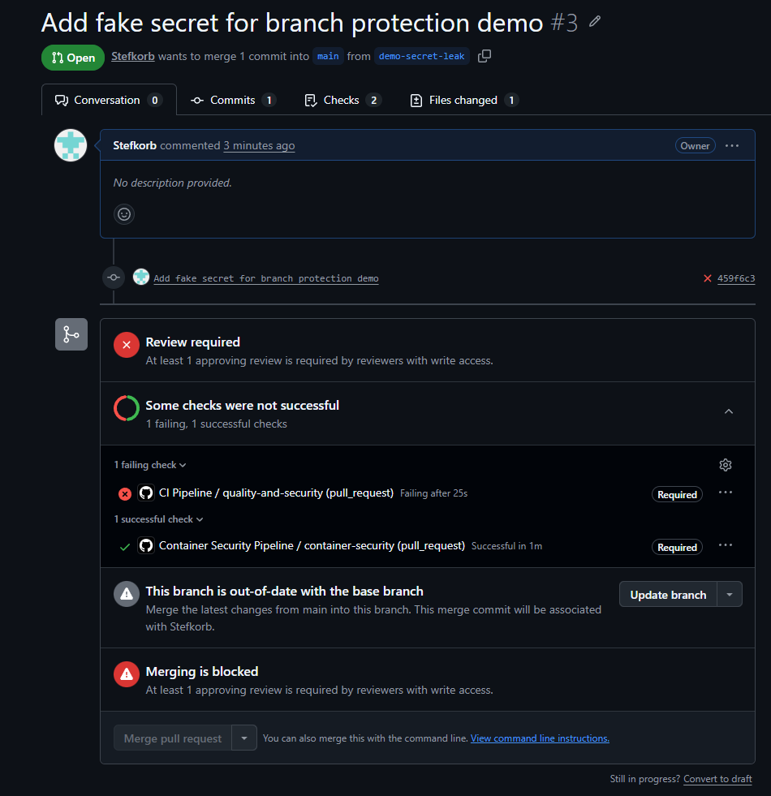

# DevSecOps Pipeline for a Containerized FastAPI Application

## Overview

This project demonstrates the design and implementation of a secure, multi-stage CI/CD pipeline across the full Software Development Lifecycle (SDLC).

The pipeline introduces structured delivery stages (code → build → release → deploy) and integrates security controls at each step.  
It is designed to reflect how a small SaaS team can transition from ad-hoc development to controlled and scalable security-aware Software Delivery process

## Business Context

A small SaaS company is developing a web application with:

- frequent code changes
- no standardized CI/CD process
- no security validation before release

This introduces risks such as:

- accidental exposure of secrets
- vulnerable dependencies entering production
- unverified container images being deployed
- lack of release control and traceability

This project addresses those gaps by implementing a secure and structured DevSecOps pipeline.

## What This Project Demonstrates

- Secure CI/CD pipeline design across the SDLC
- Integration of security controls into development workflows
- Enforcement of security policies through automated gates
- Container security validation before artifact publication
- Controlled release and deployment process

## Architecture Summary

The application is a lightweight FastAPI service that includes:

- health endpoint
- configuration endpoint
- token validation logic
- protected endpoint
- unit tests

The application is containerized and validated through multiple pipeline stages before being promoted to release.

---

## CI/CD Pipeline Overview

The pipeline follows a **build-once, promote-artifact** strategy:

1. Code is pushed to a feature branch  
2. Pull Request is opened against `main`  
3. CI pipeline runs quality,security checks and container security checks
4. Merge is blocked if checks fail
5. Approved code and tested image is merged into `main`
6. Feature branches are automatically deleted after being merged into the `main` branch.
7. Docker image is built and pushed to GHCR (tagged with commit SHA)  
8. Release workflow promotes the image to a versioned tag  
9. Staging deployment validates the release configuration  

---

## Security Controls

The pipeline integrates the following tools:

- **Black** — code formatting  
- **Flake8** — linting  
- **Pytest** — unit testing  
- **Bandit** — static analysis (SAST)  
- **pip-audit** — dependency vulnerability scanning  
- **Gitleaks** — secrets detection  
- **Hadolint** — Dockerfile best practices  
- **Trivy** — container vulnerability scanning  

### Enforcement

Security is enforced through:

- failing CI jobs on violations  
- pull request validation  
- protected `main` branch  
- Required status checks can be enforced in team environments to prevent merging unvalidated code.

---

## Pipeline Stages

### 1. Code Quality & Security

- formatting validation  
- linting  
- unit tests  
- static analysis (SAST)  
- dependency vulnerability scanning  
- secrets detection  

### 2. Container Security

- Docker image build  
- Dockerfile linting  
- container vulnerability scanning  
- policy enforcement (fail on high/critical findings)  
- image push to GHCR with immutable SHA tag  

### 3. Release Promotion

- promotion of pre-built image  
- version tagging without rebuilding  

### 4. Staging Deployment

- environment-based configuration  
- deployment validation using Docker Compose  

## Repository Structure

```text
devsecops-pipeline/
├── app/
│   ├── routes/
│   ├── services/
│   ├── tests/
│   ├── main.py
│   └── requirements.txt
├── docker/
│   └── Dockerfile
├── deploy/
│   ├── docker-compose.yml
│   └── staging/
├── docs/
├── .github/
│   └── workflows/
│       ├── ci.yml
│       ├── security.yml
│       ├── release.yml
│       └── deploy.yml
└── README.md


```

## Local Development

Run locally:

uvicorn app.main:app --reload

Run tests:

pytest app/tests -v

Build Docker image:

docker build -f docker/Dockerfile -t devsecops-demo-api:local .

Run container:

docker run --rm -p 8000:8000 devsecops-demo-api:local

## GitHub development workflow

Developers follow a feature-branch workflow aligned with the CI/CD pipeline

### Development flow

1. Sync with main branch

git checkout main
git pull origin main

1. Create a new feature branch

git checkout -b feature/(short-description)

1. Implement changes and commit

git add .
git commit -m "Describe change"

1. Push branch and open Pull request

git push -u origin featurebranch

1. A pull request is created against the main branch and must be manually reviewed and approved before merging.

1. CI/CD pipeline runs automatically on the Pull Request

- quality checks
- security scans
- container validation

1. After approval and successful checks, the branch is merged into main

- image is rebuilt
- security validation is re-executed
- artifact is published to GHCR

1. Feature branch is automatically deleted after merge

## Security Enforcement Demo

A controlled test was performed by introducing a fake secret into a pull request.

Expected behavior:
-Gitleaks detects the secret
-CI pipeline fails
-the pull request is blocked from merging into main
-This confirms that the pipeline actively enforces security policies and prevents unsafe code from reaching the main branch.

### Example Outputs

#### Gitleaks Detection (Secret Leak Identified)



> The pipeline detects a hardcoded secret using Gitleaks and fails the job.

---

#### Pull Request Blocked (Policy Enforcement)



> The pull request is blocked due to failing required checks, enforcing secure merge policies.

## Future Improvements

-cloud-based deployment (AWS)
-Infrastructure as Code (Terraform)
-monitoring and alerting
-runtime security controls
