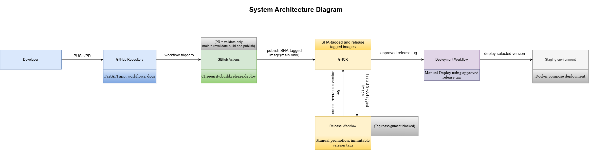
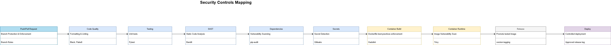

# Architecture Overview

## 1. Introduction

This document describes the architecture of the DevSecOps pipeline and the application delivery flow.

The system is designed to demonstrate a secure, structured, and production-minded CI/CD pipeline for a containerized web application.

## 2. Main Components

- Application Layer(FastAPI)
- CI/CD Pipeline(Github Actions)
- Container Registry(GHCR)
- Deployment Layer(Docker compose - staging simulation)

## System Architecture Diagram

## 3. Application Architecture

A very small FastAPI service just to demostrate the pipeline:

- REST API Endpoints
- basic token auth logic
- unit tests
- configuration-based behaviour

Structure:

app/
├── routes/
├── services/
├── tests/
├── main.py
└── requirements.txt

## 4.CI/CD Pipeline Architecture

The pipeline is triggered on:

- push to feature branches
- pull requests to  `main`
- release & deployment pipeline is triggered manually

Pipeline automated Flow:

Developer Push / Pull Request
↓
(1) Code Quality & Testing

- Code formatting (Black)
- Linting (Flake8)
- Unit tests (Pytest)

    ↓

(2) Application Security Checks

- Static Application Security Testing (SAST - Bandit)
- Secrets scanning (Gitleaks)
- Dependency vulnerability scanning (pip-audit)
- Dockerfile best-practices enforcement (Hadolint)

    ↓

(3) Container Security & Build

- GHCR authentication
- Assign immutable image tag (commit SHA)
- Build Docker image
- Image vulnerability scanning (Trivy)
- Policy gate (fail on critical vulnerabilities)
- Push image to GHCR

    ↓

(4) Release Promotion (Manual Workflow)

- Promote previously tested image
- Apply version tag (no rebuild)

    ↓

(5) Deployment Pipeline

- Controlled deployment(choosing by image version from the release workflow)
- Staging deployment using Docker Compose

## 5. Security Architecture

Security is integrated across all stages of the pipeline.

### Security Controls Mapping

The diagram below maps each security control to the corresponding stage of the delivery process. It shows how validation, policy enforcement, and controlled promotion are integrated across the CI/CD pipeline.

## 6. Artifact Flow

The pipeline follows a **build-once, promote-artifact** strategy:

- Images are built once per commit
- Tagged with immutable SHA
- Promoted to versioned releases without rebuild(manually)
- Deployed by version(manually)

### Image Build and Registry Strategy

The pipeline follows a controlled image publishing approach to ensure that only trusted code produces deployable artifacts.

#### Pull Requests

- Docker images are built and scanned (Trivy, Hadolint)
- Security policies are enforced
- **Images are NOT pushed to the registry**

This ensures that untrusted or unreviewed code does not produce publishable artifacts.

#### Main Branch

- The image is rebuilt from the merged (trusted) code
- Security scans are executed again
- The image is pushed to GHCR using an immutable SHA-based tag

This guarantees that only validated and approved code results in a published artifact.

#### Rationale

This approach enforces a clear separation between:

- **Validation phase (PR)** → build and verify  
- **Release phase (main)** → build and publish  

It prevents unsafe images from entering the registry and aligns with secure software supply chain practices.

### Automatic Branch Cleanup

Feature branches are automatically deleted after being merged into the `main` branch.

This keeps the repository clean and ensures that only active development branches remain visible.

Developers are expected to create a new branch for each change, following a short-lived branch strategy.

This ensures:

- traceability
- reproducibility
- reduced risk of drift
- scalabilty
- better control
- better security

## Release Tag Immutability

The release workflow enforces an immutable tag policy for versioned images.

Each release version is promoted from a previously validated SHA-tagged image stored in GHCR. Before creating a release tag, the workflow checks whether the requested version already exists.

If the target release tag is already present, the workflow fails and prevents reassignment.

This design provides:

- traceability between a release version and a tested artifact
- protection against accidental or unauthorized tag overwrite
- stable and auditable release references

The SHA-based image tag remains the technical source of truth, while version tags provide human-readable release references for deployment and release management.

## 7. Deployment Architecture

Deployment is implemented as a staging simulation using Docker Compose.

Key characteristics:

- environment-based configuration
- separation between build and deploy
- controlled release promotion

## 8. Summary

This architecture demonstrates how a secure and scalable CI/CD pipeline can be designed for a modern application.

It emphasizes:

- security integration across the SDLC
- policy enforcement instead of passive scanning
- controlled artifact promotion
- production-oriented delivery workflow
